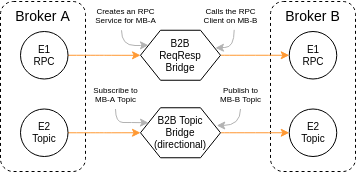

# commlib-py
Broker-based communication framework written in python 3.
Implements the most common communication patterns (RPC/ReqResp, PubSub) over a message broker.
A message broker is a communication middleware responsible for routing messages to the
proper endpoints. Some examples of message brokers are: AMQP brokers (e.g. RabbitMQ),
Apache Kafka, MQTT brokers (e.g. Mosquito and EMQX) and Redis.

Yes, Redis can also be used as a message broker for RPC and PubSub communication!!

Currently, AMQP, Redis and MQTT brokers are supported.

The goal of this project is to implement a standard communication middleware
based on message brokers, for building systems. A system can be a device, 
an IoT environment or a software platformm. Performance is also considered
as it is often used on low-cost devices, so messaging has to be fast and with
low footprint.


# Installation


```bash
python setup.py install
```

, or via pip

```bash
pip install .
```

, or by giving the git repo url to pip

```bash
pip install git+https://github.com/robotics-4-all/commlib-py.git@master
```

In order to keep minimal footprint of the implementation, the backend
communication transports (AMQP, MQTT, Redis etc) are not installed by default.

## Redis Support

In order to have access to the Redis transport you will have to install the
`redis` python package

```bash
pip install redis
```

However, there’s also a C library, Hiredis, that contains a fast parser that can offer significant speedups for some Redis commands such as LRANGE. You can think of Hiredis as an optional accelerator for Redis commands.

It is highly recommended to also install hiredis.

```
pip install hiredis
```

## AMQP Support

In order to have access to the AMQP transport you will have to installed the following dependencies:

- pika==1.1.0

```bash
pip install "pika==1.1.0"
```


## MQTT Support

In order to have access to the MQTT transport you will have to installed the following dependencies:

- paho-mqtt

```bash
pip install paho-mqtt
```


## JSON Serialization

It is recommended to use a fast json library, such as [orjson](https://github.com/ijl/orjson) 
or [ujson](https://github.com/ultrajson/ultrajson).

The framework will load and use the most performance optimal library based
on installations.


# Quick Start

The purpose of this implementation is to provide an application-level communication layer, 
by providing implementations for Remote-Procedure-Calls (RPCs), Topic-based PubSub, Preemptable Services (aka Actions), Events etc.


# User Guide

## Node

A **Node** is a software component that follows the Component-Port-Connector model.
It has input and output ports for communicating with the world. Each
port defines an endpoint and can be of the following types.

```
         +-----------------+
         |                 |
InPort  +-+     Node      +-+ OutPort
        +-+               +-+
         |                 |
         +-----------------+
```

```
                        +--------+                         
+----------+ OutPort    |        |      InPort +----------+
|         +-+ --------> |        | ---------> +-+         |
|         +-+           |        |            +-+         |
| Node A   |            | Broker |             |   Node B |
|         +-+ <-------- |        | <--------- +-+         |
|         +-+           |        |            +-+         |
+----------+ InPort     |        |     OutPort +----------+
                        +--------+
```

**Input Port**:
  - Subscriber
  - RPC Service
  - Action Service

**Output Port**:
  - Publisher
  - RPC Client
  - Action Client
  - Event Emitter

**InOut Port**:
  - RPCBridge: Bridge RPC Communication between two brokers. Directional.
  - TopicBridge: Bridge PubSub Communication between two brokers. Directional.
  - PTopicBridge: Bridge PubSub Communication between two brokers, based on a topic pattern. Directional.


Furthermore, it implements several features:
- Publish Heartbeat messages in the background for as long as the node is active
- Provide control interfaces, to `start` and `stop` the execution of the Node
- Provides methods to create endpoints and bind to Node ports.

```python
from commlib.node import Node, TransportType
from commlib.msg import RPCMessage
## Import the Redis transports
## Imports are lazy handled internally
from commlib.transports.redis import ConnectionParameters

class AddTwoIntMessage(RPCMessage):
    class Request(RPCMessage.Request):
        a: int = 0
        b: int = 0

    class Response(RPCMessage.Response):
        c: int = 0


def on_request(msg):
    print(f'On-Request: {msg}')
    resp = AddTwoIntMessage.Response(c = msg.a + msg.b)
    return resp


if __name__ == '__main__':
    conn_params = ConnectionParameters()
    node = Node(node_name='add_two_ints_node',
                connection_params=conn_params,
                # heartbeat_uri='nodes.add_two_ints.heartbeat',
                debug=True)
    rpc = node.create_rpc(msg_type=AddTwoIntMessage,
                          # rpc_name='add_two_ints_node.add_two_ints',
                          on_request=add_two_int_handler)
    node.run_forever(sleep_rate=1)
```

A Node always binds to a specific broker for implementing the input and
output ports. Of course you can instantiate and run several Nodes in a single-process 
application.

### Node class:

```python
class Node:
    def __init__(self,
                 node_name: Optional[str] = '',
                 connection_params: Optional[Any] = None,
                 transport_connection_params: Optional[Any] = None,
                 debug: Optional[bool] = False,
                 heartbeats: Optional[bool] = True,
                 heartbeat_uri: Optional[str] = None,
                 compression: CompressionType = CompressionType.NO_COMPRESSION,
                 ctrl_services: Optional[bool] = False):
```

Node methods to create and run Endpoints::

```
▾+Node : class
   +create_action(self, *args, **kwargs) : member
   +create_action_client(self, *args, **kwargs) : member
   +create_event_emitter(self, *args, **kwargs) : member
   +create_heartbeat_thread(self) : member
   +create_mpublisher(self, *args, **kwargs) : member
   +create_psubscriber(self, *args, **kwargs) : member
   +create_publisher(self, *args, **kwargs) : member
   +create_rpc(self, *args, **kwargs) : member
   +create_rpc_client(self, *args, **kwargs) : member
   +create_start_service(self, uri: str = None) : member
   +create_stop_service(self, uri: str = None) : member
   +create_subscriber(self, *args, **kwargs) : member
   +run(self) : member
   +run_forever(self, sleep_rate: float = 0.001) : member
   +stop(self) : member
```

## Endpoint (Low-level API)

It is possible to construct endpoints without binding them to a specific
Node. This is a feature to support a wider range of applications, where the
concept Node might not be usable.

One can create endpoint instances by using the following classes of each
supported transport

- RPCClient
- RPCServer
- Publisher
- Subscriber
- MPublisher (Multi-topic Publisher)
- PSubscriber (Pattern-based Subscriber)
- ActionService (Preemptable Services with feedback)
- ActionClient
- EventEmitter


```python
from commlib.transports.redis import RPCService
from commlib.transports.amqp import Subscriber
from commlib.transports.mqtt import Publisher, RPCClient
...
```

Or use the `endpoint_factory` to construct endpoints.

```python
import time
from commlib.endpoints import endpoint_factory, EndpointType, TransportType


def callback(data):
    print(data)


if __name__ == '__main__':
    topic = 'factory_test_topic'
    mqtt_sub = endpoint_factory(EndpointType.Subscriber, TransportType.MQTT)(
        topic=topic,
        on_message=callback
    )
    mqtt_sub.run()
    mqtt_pub = endpoint_factory(EndpointType.Publisher, TransportType.MQTT)(
        topic=topic,
        debug=True
    )

    data = {'a': 1, 'b': 2}
    while True:
        mqtt_pub.publish(data)
        time.sleep(1)
```

## Req/Resp (RPC) Communication

```
                             +---------------+
                   +-------->+   RPC Topic   +------+
+--------------+   |         |               |      |        +---------------+
|              +---+         +---------------+      +------->+               |
|  RPC Client  |                                             |  RPC Service  |
|              +<--+         +---------------+      +--------+               |
+--------------+   |         |Temporaty Topic|      |        +---------------+
                   +---------+               +<-----+
                             +---------------+
```


### Server Side Example

```python
from commlib.msg import RPCMessage
from commlib.node import Node
from commlib.transports.mqtt import ConnectionParameters


class AddTwoIntMessage(RPCMessage):
    class Request(RPCMessage.Request):
        a: int = 0
        b: int = 0

    class Response(RPCMessage.Response):
        c: int = 0


def add_two_int_handler(msg):
    print(f'Request Message: {msg.__dict__}')
    resp = AddTwoIntMessage.Response(c = msg.a + msg.b)
    return resp


if __name__ == '__main__':
    conn_params = ConnectionParameters()
    node = Node(node_name='add_two_ints_node',
                connection_params=conn_params,
                # heartbeat_uri='nodes.add_two_ints.heartbeat',
                debug=True)
    rpc = node.create_rpc(msg_type=AddTwoIntMessage,
                          rpc_name='add_two_ints_node.add_two_ints',
                          on_request=add_two_int_handler)
    node.run_forever(sleep_rate=1)
```

### Client Side Example

```python
import time

from commlib.msg import RPCMessage
from commlib.node import Node
from commlib.transports.mqtt import ConnectionParameters


class AddTwoIntMessage(RPCMessage):
    class Request(RPCMessage.Request):
        a: int = 0
        b: int = 0

    class Response(RPCMessage.Response):
        c: int = 0


if __name__ == '__main__':
    conn_params = ConnectionParameters()
    node = Node(node_name='myclient',
                connection_params=conn_params,
                # heartbeat_uri='nodes.add_two_ints.heartbeat',
                debug=True)
    rpc = node.create_rpc_client(msg_type=AddTwoIntMessage,
                                 rpc_name='add_two_ints_node.add_two_ints')
    node.run()

    # Create an instance of the request object
    msg = AddTwoIntMessage.Request()
    while True:
        # returns AddTwoIntMessage.Response instance
        resp = rpc.call(msg)
        print(resp)
        msg.a += 1
        msg.b += 1
        time.sleep(1)
```


## PubSub Communicaton

```
                                                    +------------+
                                                    |            |
                                            +------>+ Subscriber |
                                            |       |            |
                                            |       +------------+
                                            |
+-----------+             +------------+    |       +------------+
|           |             |            |    |       |            |
| Publisher +------------>+   Topic    +----------->+ Subscriber |
|           |             |            |    |       |            |
+-----------+             +------------+    |       +------------+
                                            |
                                            |       +------------+
                                            |       |            |
                                            +------>+ Subscriber |
                                                    |            |
                                                    +------------+
```

### Write a Simple Topic Publisher

```python
import time

from commlib.msg import PubSubMessage
from commlib.transports.mqtt import Publisher, ConnectionParameters


class SonarMessage(PubSubMessage):
    distance: float = 0.001
    horizontal_fov: float = 30.0
    vertical_fov: float = 14.0


if __name__ == "__main__":
    conn_params = ConnectionParameters(host='localhost', port=1883)
    pub = Publisher(topic=topic, msg_type=SonarMessage, conn_params=conn_params)
    pub.run()
    msg = SonarMessage(distance=2.0)
    while True:
        time.sleep(0.5)
        pub.publish(msg)
        msg.distance += 1

```

### Write a Simple Topic Subscriber

```python
import time

from commlib.msg import PubSubMessage, DataClass
from commlib.transports.mqtt import (
    Subscriber, ConnectionParameters
)


@DataClass
class SonarMessage(PubSubMessage):
    distance: float = 0.001
    horizontal_fov: float = 30.0
    vertical_fov: float = 14.0


def sonar_data_callback(msg):
    print(f'Message: {msg}')


if __name__ == "__main__":
    conn_params = ConnectionParameters(host='localhost', port=1883)
    sub = Subscriber(topic=topic,
                     on_message=sonar_data_callback,
                     conn_params=conn_params)
    sub.run()
    while True:
        time.sleep(0.001)
```

## Pattern-based Topic Subscription

For pattern-based topic subscription use the `PSubscriber` class.

```python
#!/usr/bin/env python

import sys
import time

from commlib.msg import PubSubMessage


class SonarMessage(PubSubMessage):
    distance: float = 0.001
    horizontal_fov: float = 30.0
    vertical_fov: float = 14.0


def sensor_data_callback(msg, topic):
    print(f'Sensor Data Message: {topic}:{msg}')


if __name__ == '__main__':
    topic = 'sensors.*'
    p1_topic = topic.split('*')[0] + 'sonar.front'
    p2_topic = topic.split('*')[0] + 'ir.rear'

    # Create an instance of a Patter-based Subscriber (PSubscriber)
    sub = PSubscriber(topic=topic, msg_type=SonarMessage,
                      on_message=sensor_data_callback)
    # Run the PSubscriber in the background.
    sub.run()

    # Create an instance of the communication message
    msg = SonarMessage()

    # Create an instalce of a Multi-topic Publisher (MPublisher)
    pub = MPublisher(msg_type=SonarMessage)
    pub.run()

    while True:
        time.sleep(1)
        # Publish message to topic A
        pub.publish(msg, p1_topic)
        # Publish message to topic B
        pub.publish(msg, p2_topic)
        msg.distance += 1
```

## Preemptable Services with Feedback (Actions)

Actions are [pre-emptable services](https://en.wikipedia.org/wiki/Preemption_(computing)) 
with support for asynchronous feedback publishing. This communication pattern
is used to implement services which can be stopped and can provide feedback data, such 
as the move command service of a robot.


### Write an Action Service

```python
import time

from commlib.action import GoalStatus
from commlib.msg import ActionMessage
from commlib.transports.redis import ActionService, ConnectionParameters
)


class ExampleAction(ActionMessage):
    class Goal(ActionMessage.Goal):
        target_cm: int = 0

    class Result(ActionMessage.Result):
        dest_cm: int = 0

    class Feedback(ActionMessage.Feedback):
        current_cm: int = 0


def on_goal(goal_h):
    c = 0
    res = ExampleAction.Result()
    while c < goal_h.data.target_cm:
        if goal_h.cancel_event.is_set():
            break
        goal_h.send_feedback(ExampleAction.Feedback(current_cm=c))
        c += 1
        time.sleep(1)
    res.dest_cm = c
    return res


if __name__ == '__main__':
    action_name = 'testaction'
    conn_params = ConnectionParameters()
    action = ActionService(msg_type=ExampleAction,
                           conn_params=conn_params,
                           action_name=action_name,
                           on_goal=on_goal)
    action.run()
    while True:
      time.sleep(0.001)
```

### Write an Action Client

```python
import time

from commlib.action import GoalStatus
from commlib.msg import ActionMessage
from commlib.transports.redis import ActionClient, ConnectionParameters


class ExampleAction(ActionMessage):
    class Goal(ActionMessage.Goal):
        target_cm: int = 0

    class Result(ActionMessage.Result):
        dest_cm: int = 0

    class Feedback(ActionMessage.Feedback):
        current_cm: int = 0


def on_feedback(feedback):
    print(f'ActionClient <on-feedback> callback: {feedback}')


def on_goal_reached(result):
    print(f'ActionClient <on-goal-reached> callback: {result}')


if __name__ == '__main__':
    action_name = 'testaction'
    conn_params = ConnectionParameters()
    action_c = ActionClient(msg_type=ExampleAction,
                            conn_params=conn_params,
                            action_name=action_name,
                            on_feedback=on_feedback,
                            on_goal_reached=on_goal_reached)
    action_c.run()
    goal_msg = ExampleAction.Goal(target_cm=5)
    action_c.send_goal(goal_msg)
    resp = action_c.get_result(wait=True)
    print(resp)
```

## EventEmitter

An EventEmitter can be used to fire multiple events, for event-based systems, over a single connection.

```
                                +---------+
        +---------------------> | Topic A |
        |                       +---------+
        |                                  
        |                                  
+---------------+                          
|               |               +---------+
|  EventEmitter |-------------->| Topic B |
|               |               +---------+
+---------------+                          
        |                                  
        |                                  
        |                       +---------+
        +---------------------> | Topic C |
                                +---------+
```

An Event has the following properties:

```python
class Event(BaseModel):
    name: Text
    uri: Text
    description: Text = ''
    data: Dict[str, Any] = {}
```

- name: The name of the Event
- uri: Broker URI to send the Event
- description: Optional Description of the Event.
- data: Optional data to attach on the Event.

Below is an example of an EventEmitter used to fire the `bedroom.lights.on` and `bedroom.lights.off` events.

```python
#!/usr/bin/env python

import time

from commlib.events import Event
from commlib.transports.mqtt import EventEmitter, ConnectionParameters


if __name__ == '__main__':
    conn_params = ConnectionParameters()
    emitter = EventEmitter(conn_params=conn_params, debug=True)

    eventA = Event(name='TurnOnBedroomLights', uri='bedroom.lights.on')
    eventB = Event(name='TurnOffBedroomLights', uri='bedroom.lights.off')

    emitter.send_event(eventA)
    time.sleep(2)
    emitter.send_event(eventB)
```


## Broker-to-broker (B2B) bridges

In the context of IoT and CPS, it is a common requirement to bridge messages
between message brokers, based on application-specific rules. An example is to 
bridge analytics (preprocessed) data from the Edge to the Cloud. And what happens
if the brokers use different communication protocols?


```
                                  {Bridge}
[Producer] -------> [Broker A] -------------> [Broker B] ------> [Consumer]
                                  {Bridge}
```

In the context of the current work, communication bridges are implemented for
PubSub and RPC communication between various message brokers. Currently, MQTT, 
AMQP and Redis are supported.




Below are examples of an MQTT Redis-to-MQTT Bridge and a Redis-to-MQTT
Topic Bridge.

```python
#!/usr/bin/env python

import time

import commlib.transports.amqp as acomm
import commlib.transports.redis as rcomm
import commlib.transports.mqtt as mcomm

from commlib.bridges import (
    RPCBridge, RPCBridgeType, TopicBridge, TopicBridgeType
)


def redis_to_mqtt_rpc_bridge():
    """
    [RPC Client] ----> [Broker A] ------> [Broker B] ---> [RPC Service]
    """
    bA_params = rcomm.ConnectionParameters()
    bB_params = mcomm.ConnectionParameters()
    bA_uri = 'ops.start_navigation'
    bB_uri = 'thing.robotA.ops.start_navigation'
    br = RPCBridge(RPCBridgeType.REDIS_TO_MQTT,
                   from_uri=bA_uri, to_uri=bB_uri,
                   from_broker_params=bA_params,
                   to_broker_params=bB_params,
                   debug=False)
    br.run()


def redis_to_mqtt_topic_bridge():
    """
    [Producer Endpoint] ---> [Broker A] ---> [Broker B] ---> [Consumer Endpoint]
    """
    bA_params = rcomm.ConnectionParameters()
    bB_params = mcomm.ConnectionParameters()
    bA_uri = 'sonar.front'
    bB_uri = 'thing.robotA.sensors.sonar.font'
    br = TopicBridge(TopicBridgeType.REDIS_TO_MQTT,
                     from_uri=bA_uri, to_uri=bB_uri,
                     from_broker_params=bA_params,
                     to_broker_params=bB_params,
                     debug=False)
    br.run()


if __name__ == '__main__':
    redis_to_mqtt_rpc_bridge()
    redis_to_mqtt_topic_bridge()
```

A Pattern-based Topic Bridge (PTopicBridge) example is also shown below.

```python
#!/usr/bin/env python

import time

import commlib.transports.amqp as acomm
import commlib.transports.redis as rcomm
from commlib.msg import PubSubMessage, DataClass

from commlib.bridges import PTopicBridge


@DataClass
class SonarMessage(PubSubMessage):
    distance: float = 0.001
    horizontal_fov: float = 30.0
    vertical_fov: float = 14.0


if __name__ == '__main__':
    """
    [Broker A] ------------> [Broker B] ---> [Consumer Endpoint]
    """
    bA_uri = 'sensors.*'
    bB_namespace = 'myrobot'

    bA_params = rcomm.ConnectionParameters()
    bB_params = mcomm.ConnectionParameters()

    br = PTopicBridge(TopicBridgeType.REDIS_TO_MQTT,
                      bA_uri,
                      bB_namespace,
                      bA_params,
                      bB_params,
                      msg_type=SonarMessage,
                      debug=True)
    br.run()
```

## Action bridges

### TODO

## TCP Bridge

TCP bridge forwards tcp packages between two endpoints:

```

[Client] -------> [TCPBridge, port=xxxx] ---------> [TCP endpoint, port=xxxx]

```

A one-to-one connection is performed between the bridge and the endpoint. 


## REST Proxy

Implements a REST proxy, that enables invocation of REST services via
broker communication. The proxy uses an RPCService to run the broker endpoint and
an http client for calling REST services. An RPC call is transformed into proper,
REST-compliant, http request, based on the input parameters.


```python
class RESTProxyMessage(RPCMessage):
    @DataClass
    class Request(RPCMessage.Request):
        host: str
        port: int = 80
        path: str = '/'
        verb: str = 'GET'
        query_params: Dict = DataField(default_factory=dict)
        path_params: Dict = DataField(default_factory=dict)
        body_params: Dict = DataField(default_factory=dict)
        headers: Dict = DataField(default_factory=dict)

    @DataClass
    class Response(RPCMessage.Response):
        data: Dict = DataField(default_factory=dict)
```

Responses from the REST services are returned to clients in the form of a 
`RPCMessage.Response` message.


## Transports

### AMQP / RabbitMQ

RPC (request/reply) and PubSub Endpoints are supported by the protocol itself (AMQP), using dedicated exchanges.

For RPC enpoints a `Direct Exchange` is used to route requests and responses,
optionally using the [Direct Reply-to](https://www.rabbitmq.com/direct-reply-to.html).
If the `Direct Reply-to` feature is used, then RPC endpoints must publish
to the default exchange `""`.

To use `Direct Reply-to`, an RPC client should:
- Consume from the pseudo-queue `amq.rabbitmq.reply-to` in no-ack mode.
- Set the `reply-to` property in their request message to `amq.rabbitmq.reply-to`.

Meta-information such as the serialization method used, is passed through the
[message properties](https://www.rabbitmq.com/consumers.html#message-properties)
metadata, as specified my AMQP.


### Redis

PubSub endpoints uses the out-of-the-box [Redis pubsub channel](https://redis.io/topics/pubsub) to exchange messages. PubSub message payload in Redis includes the
data of the message and meta-information (header) regarding serialization method used, 
timestamp, etc. Below is an example of the payload for pubsub communication.

```
{
  'data': {},
  'header': {
    'timestamp': <int>,
    'properties': {
      'content_type': 'application/json',
      'content_encoding': 'utf8'
    }
  }
}
```

This is useful for transparency between brokers. Default values are evident
in the previous example.

Req/Resp communication (RPC) is not supported out-of-the-box. To support
RPC communication over Redis, a custom layer implements the pattern for both endpoints 
using Redis Lists to represent queues. RPC server listens for requests from
a list (LPOP / BLPOP), while an RPC client sends request messages to that list (RPUSH).
In order for the client to be able to receive responses, he must listen to a temporary queue.
To achieve this, the request message must include a `reply_to` property that is 
used by the RPCServer implementation to send the response message. Furthermore,
`serialization` and `encoding` properties are defined. Finally, the header
includes a `timestamp`, that indicates the time that the message was sent to to wire.


Below is the  data model of the request message.

```
{
  'data': {},
  'header': {
    'timestamp': <int>,
    'reply_to': <str>,
    'properties': {
      'content_type': 'application/json',
      'content_encoding': 'utf8'
    }
  }
}
```

**Note**: The **RPC Client** implementation is responsible to remove any created 
temporary queues!


### MQTT

PubSub message payload in MQTT includes the
data of the message and meta-information (header) regarding serialization method used, 
timestamp, etc. Below is an example of the payload for pubsub communication.

```
{
  'data': {},
  'header': {
    'timestamp': <int>,
    'properties': {
      'content_type': 'application/json',
      'content_encoding': 'utf8'
    }
  }
}
```

This is useful for transparency between brokers. Default values are evident
in the previous example.

Though, Req/Resp communication (RPC) is not supported out-of-the-box. To support
RPC communication over MQTT, a custom layer implements the pattern for both endpoints 
using MQTT topics. RPC server listens for requests at a specific topic,
while an RPC client listens to a temporary topic for response messages.
For the server to know where to send the response, the request message must include a `reply_to` property that is 
used by the RPCServer implementation to send the response message. Furthermore,
`serialization` and `encoding` properties are defined. Finally, the header
includes a `timestamp`, that indicates the time that the message was sent to to wire.

Below is the data model of the Request message.

```json
{
  'data': {},
  'header': {
    'timestamp': <int>,
    'reply_to': <str>,
    'properties': {
      'content_type': 'application/json',
      'content_encoding': 'utf8'
    }
  }
}
```

# Examples

Examples can be found at the [examples/](./examples) directory of this repository.


# Tests

Run tests by executing `tox` command under this repo directory:

```bash
make tests
```

**TODO - Currently working on!!**

# Docs

Make docs by running:

```bash
make docs
```

**TODO - Currently working on!!**

# Contributions

- [klpanagi](https://github.com/klpanagi)

